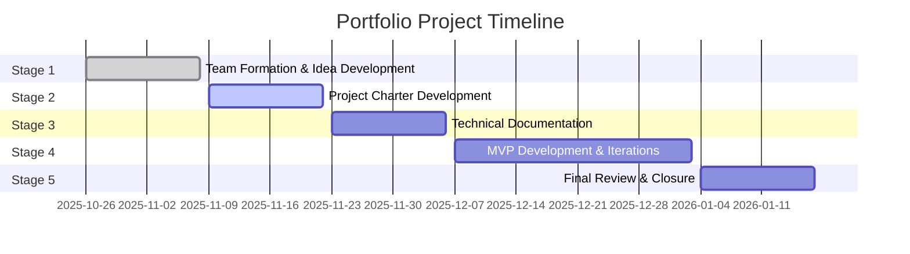

# Bookpass
# Student-to-Student Marketplace for Used Textbooks

## 📌 Project Overview
This project aims to build the first dedicated marketplace in Saudi Arabia for university students to buy and sell used textbooks. By providing a secure, centralized platform, the goal is to solve challenges around access, safety, compliance, and verification—helping students save money while supporting sustainable resource use.

---

## 🎯 Objectives

### **Purpose**
Provide Saudi students with a safe, convenient, and environmentally conscious way to exchange university textbooks, reducing financial burden and resource waste.

### **SMART Objectives**
- Achieve **13% coverage** of available used textbooks across targeted universities within the first 3 months.  
- Reach **90% verification accuracy** for book conditions, with at least **1000 books** verified in phase one.  
- Ensure **100% secure payment and delivery processes** for all completed transactions during the initial 3 months.

---

## 👥 Stakeholders & Team Roles

### **Stakeholders**
- **Internal:**  
  Project Manager, Developers  
- **External:**  
  Partner bookstores (delivery), verification services, university students, instructors, campus administration

### **Team Members & Roles**
- **Abdullah Alshebel – Project Manager**  
  Leads coordination, manages timelines, and ensures milestones are met.

- **Abdulrahman Alhussainy – UI/UX Designer**  
  Designs interfaces, creates wireframes, and enhances user experience.

- **Abdullah Alsanie – Full Stack Developer (Frontend Focus)**  
  Responsible for frontend development, integrations, and backend support.

- **Abdulrahman Altayar – Full Stack Developer (Backend Focus)**  
  Handles backend architecture, database design, and API development.

---

## 📦 Scope

### **In-Scope**
- Secure payment system  
- University textbook listings  
- Basic search filtering  
- User profiles & authentication  
- CRUD operations for listings
- ISBN-based textbook management  
- Delivery via bookstore partnerships  

### **Out-of-Scope**
- University notes, summaries, or study guides  
- Advanced payment methods (e.g., Tabby, Apple Pay)  
- Advanced sorting algorithms  
 

---

## ⚠️ Risks & Mitigation

| Risk | Mitigation |
|------|------------|
| Delays in implementation | Milestone planning & timeline management |
| Data breach | Use secure, vetted services |
| Limited adoption | Promote through university hubs |
| Verification backlog | Automate, integrate partner verification |

---

## 🗂 High-Level Plan (Timeline & Phases)

## Deliverables

### **Fully functioning book-selling marketplace web platform that includes:**
- Feature allowing students to post, browse, and search for available used textbooks.
- Fully implemented payment processing for textbook transactions.
- Listings management for sellers, including add/edit/delete options.
- Search and filter by title, ISBN, subject, or course.
- User-friendly interface for locating books efficiently.
- Account creation for students (buyer/seller) with secure login.
- Profile management, including purchase/sale history.
- Ability for users to create, read, update, and delete their textbook listings.
- User guides or quick-start docs
- Process and system to verify the condition of books
- QA test cases/reports showing coverage of core features.
