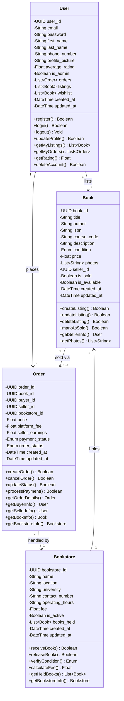

```mermaid
classDiagram
    class User {
        -UUID user_id
        -String email
        -String password
        -String first_name
        -String last_name
        -String phone_number
        -String profile_picture
        -Float average_rating
        -Boolean is_admin
        -List~Order~ orders
        -List~Book~ listings
        -List~Book~ wishlist
        -DateTime created_at
        -DateTime updated_at
        +register() Boolean
        +login() Boolean
        +logout() Void
        +updateProfile() Boolean
        +getMyListings() List~Book~
        +getMyOrders() List~Order~
        +getRating() Float
        +deleteAccount() Boolean
    }

    class Book {
        -UUID book_id
        -String title
        -String author
        -String isbn
        -String course_code
        -String description
        -Enum condition
        -Float price
        -List~String~ photos
        -UUID seller_id
        -Boolean is_sold
        -Boolean is_available
        -DateTime created_at
        -DateTime updated_at
        +createListing() Boolean
        +updateListing() Boolean
        +deleteListing() Boolean
        +markAsSold() Boolean
        +getSellerInfo() User
        +getPhotos() List~String~
    }

    class Order {
        -UUID order_id
        -UUID book_id
        -UUID buyer_id
        -UUID seller_id
        -UUID bookstore_id
        -Float price
        -Float platform_fee
        -Float seller_earnings
        -Enum payment_status
        -Enum order_status
        -DateTime created_at
        -DateTime updated_at
        +createOrder() Boolean
        +cancelOrder() Boolean
        +updateStatus() Boolean
        +processPayment() Boolean
        +getOrderDetails() Order
        +getBuyerInfo() User
        +getSellerInfo() User
        +getBookInfo() Book
        +getBookstoreInfo() Bookstore
    }

    class Bookstore {
        -UUID bookstore_id
        -String name
        -String location
        -String university
        -String contact_number
        -String operating_hours
        -Float fee
        -Boolean is_active
        -List~Book~ books_held
        -DateTime created_at
        -DateTime updated_at
        +receiveBook() Boolean
        +releaseBook() Boolean
        +verifyCondition() Enum
        +calculateFee() Float
        +getHeldBooks() List~Book~
        +getBookstoreInfo() Bookstore
    }

    User "1" --> "*" Book : lists
    User "1" --> "*" Order : places
    Book "1" --> "0..1" Order : sold via
    Order "*" --> "1" Bookstore : handled by
    Bookstore "1" --> "*" Book : holds
```
