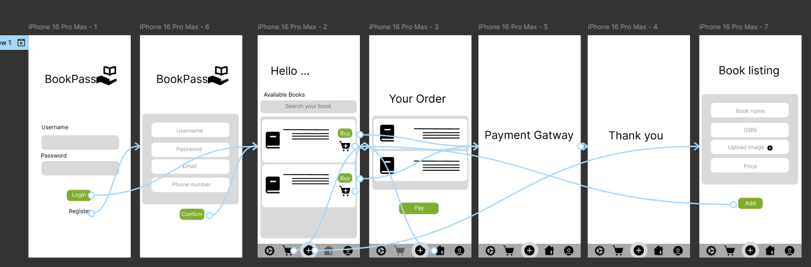
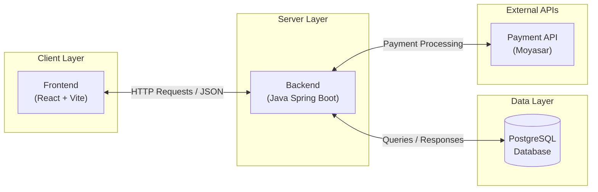
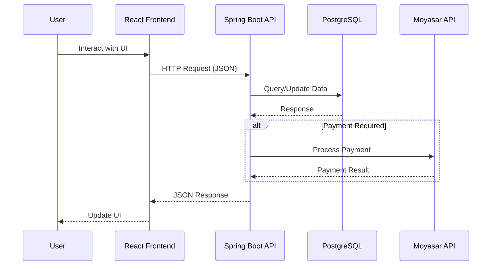
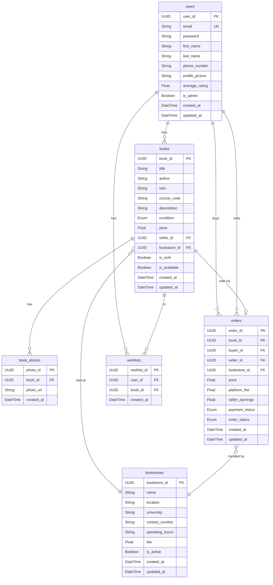
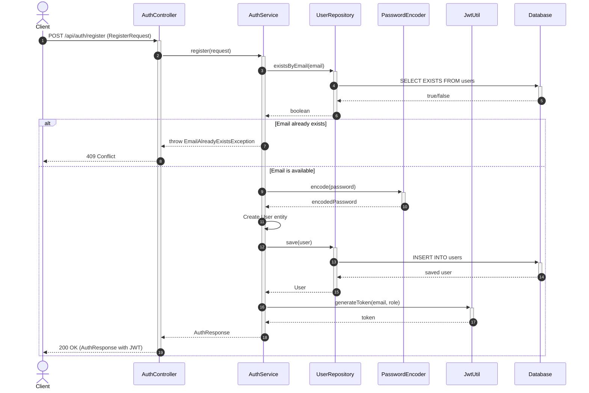
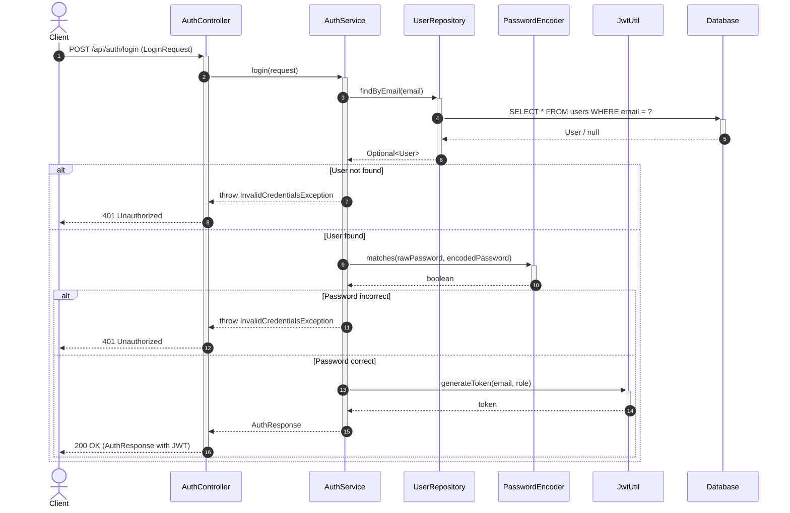
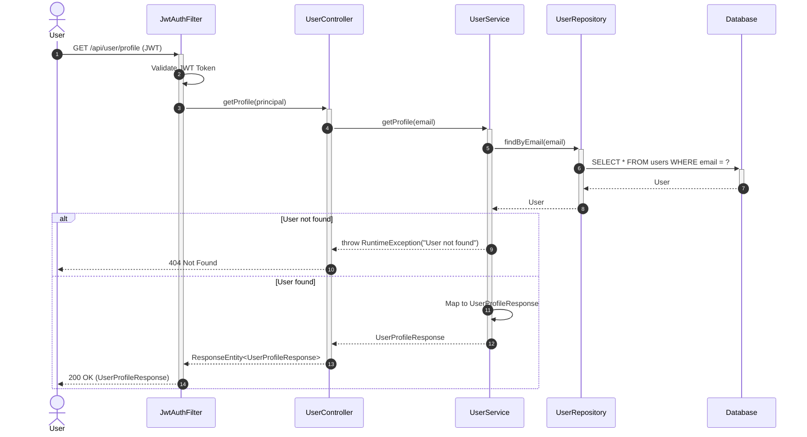
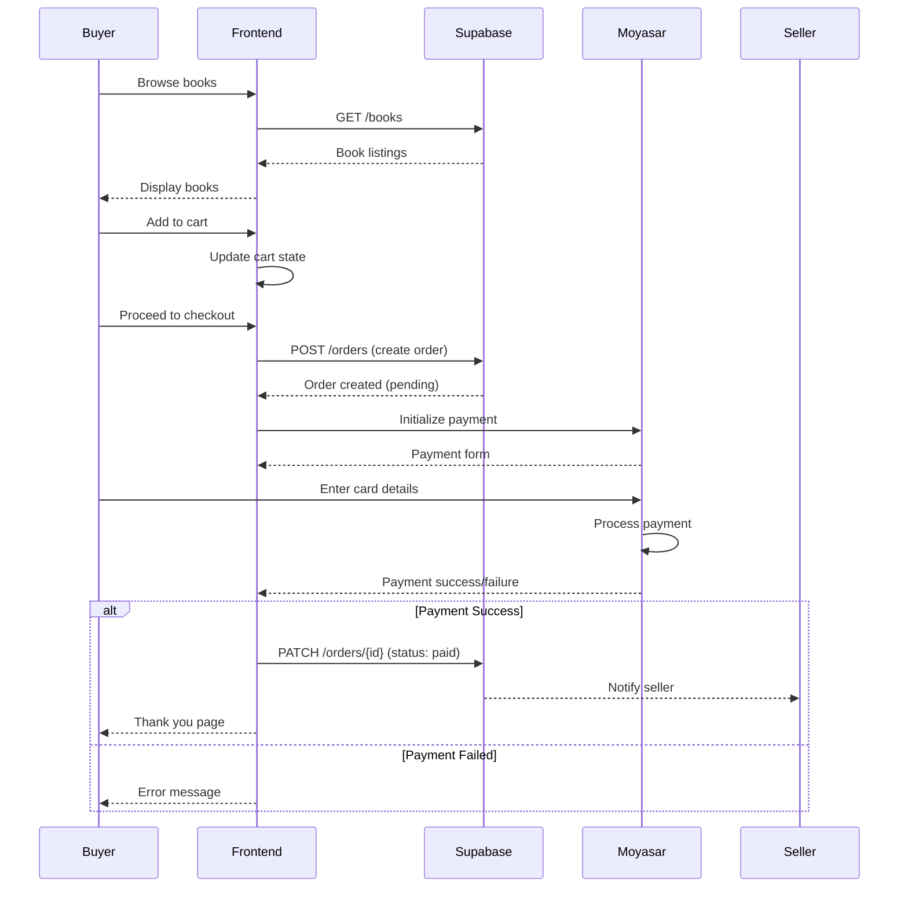
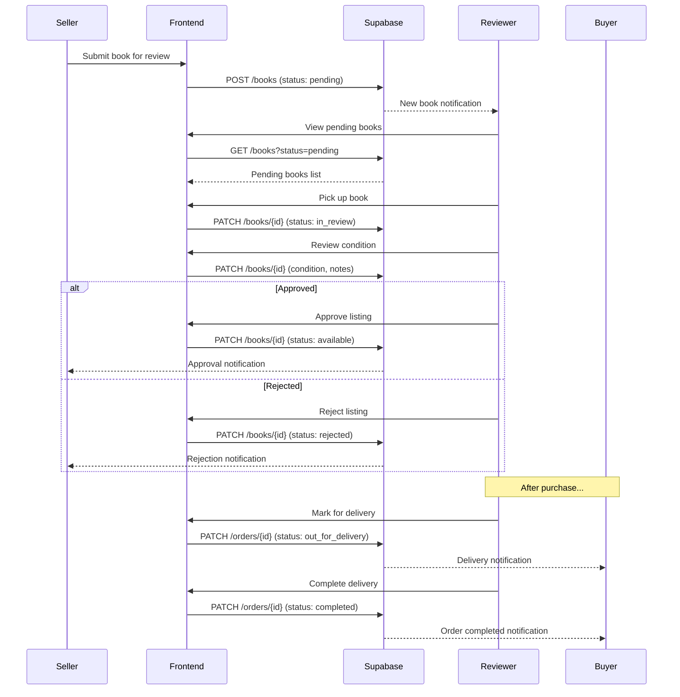

# Bookpass - Technical Documentation

> A used textbook marketplace platform for Saudi university students

---

## Table of Contents

1. [User Stories](#1-user-stories)
2. [Mockups](#2-mockups)
3. [System Architecture](#3-system-architecture)
4. [Class Diagram](#4-class-diagram)
5. [ER Diagram / Database Schema](#5-er-diagram--database-schema)
6. [Sequence Diagrams](#6-sequence-diagrams)
7. [API Specifications](#7-api-specifications)
8. [SCM Strategy](#8-scm-strategy)
9. [QA Strategy](#9-qa-strategy)
10. [Technical Justifications](#10-technical-justifications)

---

## 1. User Stories

See the complete list of prioritized user stories in [User_Stories.md](./User_Stories.md).

### Summary by Feature Area

| Feature Area | User Stories | Priority |
|--------------|--------------|----------|
| Landing Page | US-001, US-002 | MUST HAVE |
| Authentication | US-003, US-004, US-005, US-006 | MUST HAVE |
| User Profile | US-007, US-008 | MUST HAVE |
| Book Listing & Availability | US-009, US-010, US-011, US-012 | MUST HAVE |
| Shopping Cart | US-013, US-014, US-015 | MUST HAVE |
| Payment (Moyasar) | US-016, US-017 | MUST HAVE |
| Thank You Page | US-018 | MUST HAVE |
| Reviewer Page | US-019, US-020, US-021, US-022, US-023, US-024, US-025 | MUST HAVE |
| UX/UI Design | US-026, US-027, US-028, US-029 | MUST HAVE |
| Error Pages | US-030, US-031 | MUST HAVE |
| Testing | US-032, US-033 | MUST HAVE |
| Enhancements | US-034, US-035 | SHOULD HAVE |
| Nice-to-have | US-036, US-037, US-038 | COULD HAVE |

---

## 2. Mockups

The following mockup shows the main UI design for the Bookpass platform:



---

## 3. System Architecture

### High-Level Architecture Diagram



### Architecture Overview

The system is structured as a full-stack web platform with clear separation between components:

| Component | Technology | Description |
|-----------|------------|-------------|
| **Frontend** | React + Vite | Single Page Application with RTL support |
| **Backend** | Java Spring Boot | REST API server with JWT authentication |
| **Database** | PostgreSQL | Relational database for all data storage |
| **Authentication** | Spring Security + JWT | Token-based authentication |
| **Payment Gateway** | Moyasar | Saudi payment processing (Visa, MasterCard, MADA) |

### Data Flow



---

## 4. Class Diagram

```mermaid
classDiagram
    class User {
        -UUID user_id
        -String email
        -String password
        -String first_name
        -String last_name
        -String phone_number
        -String profile_picture
        -Float average_rating
        -Boolean is_admin
        -List~Order~ orders
        -List~Book~ listings
        -List~Book~ wishlist
        -DateTime created_at
        -DateTime updated_at
        +register() Boolean
        +login() Boolean
        +logout() Void
        +updateProfile() Boolean
        +getMyListings() List~Book~
        +getMyOrders() List~Order~
        +getRating() Float
        +deleteAccount() Boolean
    }

    class Book {
        -UUID book_id
        -String title
        -String author
        -String isbn
        -String course_code
        -String description
        -Enum condition
        -Float price
        -List~String~ photos
        -UUID seller_id
        -Boolean is_sold
        -Boolean is_available
        -DateTime created_at
        -DateTime updated_at
        +createListing() Boolean
        +updateListing() Boolean
        +deleteListing() Boolean
        +markAsSold() Boolean
        +getSellerInfo() User
        +getPhotos() List~String~
    }

    class Order {
        -UUID order_id
        -UUID book_id
        -UUID buyer_id
        -UUID seller_id
        -UUID bookstore_id
        -Float price
        -Float platform_fee
        -Float seller_earnings
        -Enum payment_status
        -Enum order_status
        -DateTime created_at
        -DateTime updated_at
        +createOrder() Boolean
        +cancelOrder() Boolean
        +updateStatus() Boolean
        +processPayment() Boolean
        +getOrderDetails() Order
        +getBuyerInfo() User
        +getSellerInfo() User
        +getBookInfo() Book
        +getBookstoreInfo() Bookstore
    }

    class Bookstore {
        -UUID bookstore_id
        -String name
        -String location
        -String university
        -String contact_number
        -String operating_hours
        -Float fee
        -Boolean is_active
        -List~Book~ books_held
        -DateTime created_at
        -DateTime updated_at
        +receiveBook() Boolean
        +releaseBook() Boolean
        +verifyCondition() Enum
        +calculateFee() Float
        +getHeldBooks() List~Book~
        +getBookstoreInfo() Bookstore
    }

    User "1" --> "*" Book : lists
    User "1" --> "*" Order : places
    Book "1" --> "0..1" Order : sold via
    Order "*" --> "1" Bookstore : handled by
    Bookstore "1" --> "*" Book : holds
```



---

## 5. ER Diagram / Database Schema



### Database Tables Summary

| Table | Description |
|-------|-------------|
| `users` | Registered students and admins |
| `books` | Textbook listings with details |
| `book_photos` | Multiple photos per book |
| `orders` | Purchase transactions |
| `bookstores` | University hub pickup locations |
| `wishlists` | User saved books |

---

## 6. Sequence Diagrams

### 6.1 User Registration Flow



### 6.2 User Login Flow



### 6.3 User Profile Flow



### 6.4 Book Purchase Flow



### 6.5 Reviewer Workflow (Mermaid)



---

## 7. API Specifications

### 7.1 External APIs

| API | Provider | Purpose | Documentation |
|-----|----------|---------|---------------|
| **Payment Gateway** | Moyasar | Secure payment processing (Visa, MasterCard, MADA) | [Moyasar API Docs](https://docs.moyasar.com/api/api-introduction) |
| **Email Service** | Resend | Transactional emails (order confirmations, notifications) | [Resend Webhooks](https://resend.com/webhooks) |

### 7.2 Internal API Endpoints

Use the [Internal-API.yaml](./Internal-API.yaml) with [Swagger Editor](https://editor.swagger.io) for full interactive documentation.

#### Authentication Endpoints

| Method | Endpoint | Description | Auth Required |
|--------|----------|-------------|---------------|
| POST | `/auth/register` | Register new user | No |
| POST | `/auth/login` | Login and get JWT | No |

#### User Endpoints

| Method | Endpoint | Description | Auth Required |
|--------|----------|-------------|---------------|
| GET | `/users/me` | Get current user profile | Yes |
| PATCH | `/users/me` | Update user profile | Yes |

#### Book Endpoints

| Method | Endpoint | Description | Auth Required |
|--------|----------|-------------|---------------|
| GET | `/books` | List all books (with filters) | No |
| POST | `/books` | Create new book listing | Yes |
| GET | `/books/{id}` | Get book details | No |
| PATCH | `/books/{id}` | Update book listing | Yes (owner) |
| DELETE | `/books/{id}` | Delete book listing | Yes (owner/admin) |

#### Order Endpoints

| Method | Endpoint | Description | Auth Required |
|--------|----------|-------------|---------------|
| GET | `/orders` | List user's orders | Yes |
| POST | `/orders` | Create new order | Yes |
| GET | `/orders/{id}` | Get order details | Yes |

#### Verification Endpoints (Admin)

| Method | Endpoint | Description | Auth Required |
|--------|----------|-------------|---------------|
| POST | `/verification/request` | Submit verification request | Yes |
| GET | `/admin/verifications` | List pending verifications | Yes (admin) |
| PATCH | `/admin/verifications/{id}` | Approve/reject verification | Yes (admin) |

### 7.3 Request/Response Examples

#### Register User

**Request:**
```json
POST /auth/register
{
  "email": "student@university.edu.sa",
  "password": "SecurePass123",
  "fullName": "Ahmed Mohammed",
  "campus": "Riyadh"
}
```

**Response (201 Created):**
```json
{
  "id": "uuid-here",
  "email": "student@university.edu.sa",
  "fullName": "Ahmed Mohammed",
  "campus": "Riyadh",
  "verified": false,
  "createdAt": "2026-01-08T12:00:00Z"
}
```

#### Create Book Listing

**Request:**
```json
POST /books
Authorization: Bearer <jwt-token>
{
  "title": "Introduction to Algorithms",
  "author": "Thomas H. Cormen",
  "description": "4th Edition, excellent condition",
  "condition": "like_new",
  "price": 150.00,
  "currency": "SAR",
  "campus": "Riyadh",
  "images": ["https://storage.example.com/book1.jpg"]
}
```

**Response (201 Created):**
```json
{
  "id": "book-uuid",
  "ownerId": "user-uuid",
  "title": "Introduction to Algorithms",
  "author": "Thomas H. Cormen",
  "condition": "like_new",
  "price": 150.00,
  "currency": "SAR",
  "status": "active",
  "createdAt": "2026-01-08T12:00:00Z"
}
```

---

## 8. SCM Strategy

We use **GitHub** as the version control platform and follow a **Simplified Git Flow** branching strategy.

### Branches

| Branch | Purpose |
|--------|---------|
| `main` | Stable production branch |
| `dev` | Primary development/integration branch |
| `feature/*` | Individual feature branches |

### Workflow

```
main ─────────────────────────────────────────► (production releases)
  │                                    ▲
  │                                    │ merge
  ▼                                    │
dev ──────┬───────┬───────┬───────────►
          │       │       │
          ▼       ▼       ▼
      feature/  feature/  feature/
      auth      books     payment
```

### Process

1. Developers create **feature branches** from `dev`
2. Work is committed **regularly** with meaningful messages
3. A **Pull Request (PR)** is opened to merge into `dev`
4. **One or two reviewers** must approve the PR
5. After approval, the PR creator merges into `dev`
6. Once development is complete, `dev` is merged into `main` for production release

### Commit Message Format

```
type(scope): short description

- feat: new feature
- fix: bug fix
- docs: documentation changes
- style: formatting, no code change
- refactor: code restructuring
- test: adding tests
```

---

## 9. QA Strategy

### Testing Objectives

- Ensure all API endpoints behave correctly through their real HTTP interface
- Verify critical user flows work end-to-end after each deployment
- Detect breaking changes early through focused integration and smoke testing

### Testing Levels

| Level | Scope | Tools |
|-------|-------|-------|
| **Integration Testing** | API endpoints, request/response validation | Swagger UI |
| **Smoke Testing** | Critical user journeys, deployment verification | Manual |

### Integration Testing Process (Swagger)

1. Identify all public API endpoints in OpenAPI specification
2. For each endpoint, design:
   - At least one valid "happy path" request
   - One or more negative cases (invalid data, unauthorized access)
3. Execute requests using Swagger UI:
   - Confirm HTTP status codes are correct
   - Confirm response body matches documented schema
4. Mark each test as passed/failed and create issues for failures

### Smoke Testing Process

**Scope:** Focus on high-value, high-risk flows:
- Application start and basic navigation
- User authentication (sign up / login / logout)
- Primary business actions (book listing, cart, checkout)

**Execution:**
- Run smoke tests on deployed environment after each significant change
- Execute each flow manually, observing completion without errors

**Exit Criteria:**
- ✅ All smoke tests pass → Build is stable
- ❌ Any smoke test fails → Build is rejected, fixes required

### Test Tracking

| Tool | Purpose |
|------|---------|
| Jira | Issue tracking, test management |
| Swagger UI | API integration testing |

---

## 10. Technical Justifications

### Architecture Choices

The system uses a **full-stack web platform** with clear separation between React frontend client, backend APIs, and data storage. An **API-first backend** approach enables future mobile apps and external integrations without redesigning the core platform.

### Technology Selection

| Choice | Justification |
|--------|---------------|
| **React + Vite** | Fast development, component-based UI, strong ecosystem |
| **Supabase** | Rapid backend setup, built-in auth, real-time features, PostgreSQL |
| **PostgreSQL** | Robust relational database, complex queries, data integrity |
| **Moyasar** | Saudi-focused payment gateway, MADA support, local compliance |
| **Resend** | Modern email API, reliable delivery, simple integration |

### Domain-Specific Decisions

| Decision | Rationale |
|----------|-----------|
| **Textbooks only** | Narrow scope for MVP, excludes notes/summaries |
| **University hub pickup** | Solves trust/verification issue, ensures quality |
| **ISBN-based cataloging** | Precise book identification, course matching |
| **Arabic RTL first** | Primary user base is Saudi students |

### Process & Collaboration

| Practice | Benefit |
|----------|---------|
| **Git Flow branching** | Keeps collaboration manageable, preserves stability |
| **PR reviews** | Knowledge sharing, prevents regressions |
| **Swagger-driven testing** | Clear API contract, reduces drift |

---

## Files in This Folder

| File | Description |
|------|-------------|
| `README.md` | This technical documentation |
| `User_Stories.md` | Detailed user stories (38 stories) |
| `Internal-API.yaml` | OpenAPI/Swagger specification |
| `Mockup.png` | UI mockup/prototype |